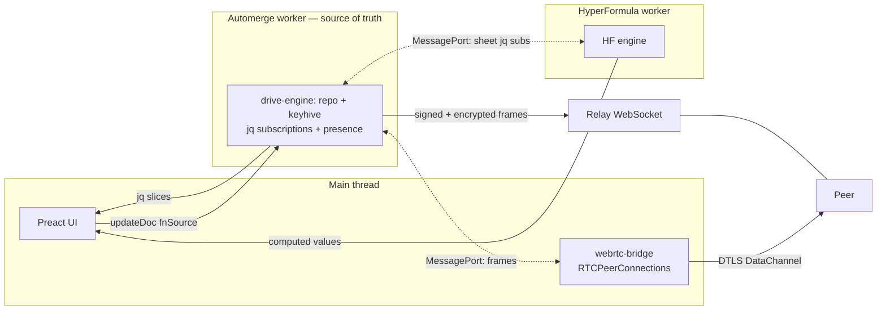
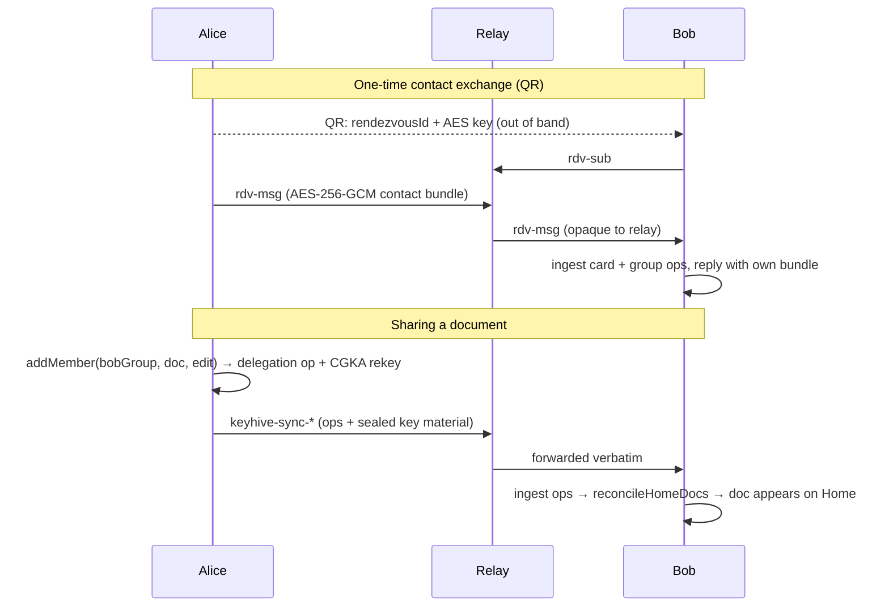
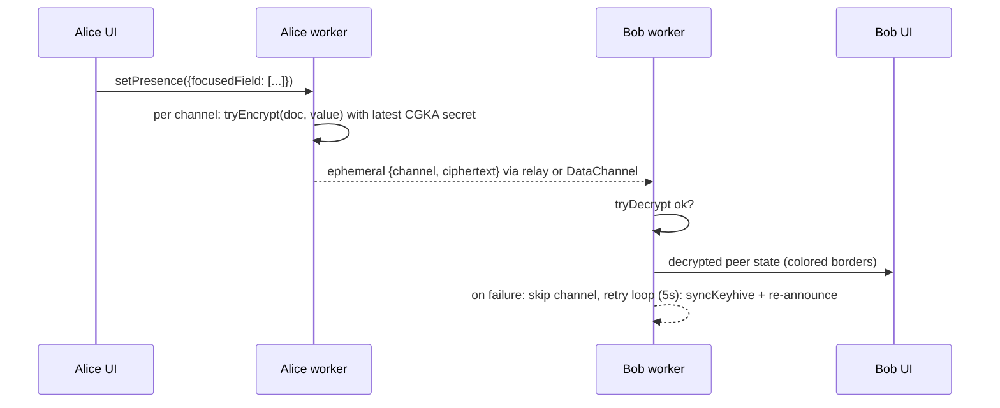

# Drive — Deep Dive

## Local-first, end-to-end-encrypted collaborative documents

- **Automerge** CRDTs — conflict-free offline editing and sync
- **Keyhive** — capability-based access control + E2E encryption (CGKA/BeeKEM)
- **Preact PWA** — Calendar · TaskList · DataGrid
- Stateless relay + opportunistic P2P; the network never sees plaintext

<!--
Table of contents:
 1. Architecture
 2. The worker is the source of truth
 3. An installable, offline-first PWA
 4. Identity: devices are Individuals, users are Groups
 5. Sharing a doc = granting a user-group
 6. Contacts & device linking: the encrypted rendezvous
 7. Share flow, end to end
 8. Background: CGKA, BeeKEM, and "the last-ratcheted key"
 9. One encryption boundary: the wrapped network adapter
10. Doc blobs: the interceptor & predecessor-key chain
11. Transitive access: the home page is a keyhive query
12. The WASM is non-reentrant (and presence made it matter)
13. Automerge document design
14. Validation runs on every change — and only advises
15. DataGrid storage: id-keyed everything
16. Ordering without collisions: fractional indices
17. Formulas: ids on disk, A1 on screen, HF in a worker
18. Conditional formatting: reuse of the formula machinery
19. Relay frame reference
20. The three encrypted channels (and the mailbox that isn't)
21. Opportunistic P2P: relay by default, direct when possible
22. Presence: broadcast document paths, not DOM nodes
23. Presence encryption & self-healing
24. Gotcha: leaving a document
25. Gotcha: revocation is silent
26. Gotcha: two tabs, one identity
27. Gotcha: what keyhive itself had to learn (2 slides)
28. Takeaways
-->

---

## Architecture



*Diagrams are mermaid fences: GitHub renders them natively; vanilla Marp shows them as code (use a mermaid plugin when exporting slides).*

---

## The worker is the source of truth

The main thread renders UI and **never holds a full document**.

- **Document manipulation** — mutations are functions, *serialized* across the boundary: `updateDoc(docId, fn, ...args)` ships `fn`'s source text; the engine revives it with `new Function('return ' + fnSource)()` and runs it inside `handle.change()`
- **Peer sync** — repo, keyhive WASM, and every transport live in the worker
- **Query caching** — the UI subscribes to **jq slices** (`subscribeQuery(docId, filter, cb)`); the worker re-runs the filter and pushes on every change, local or remote
- Why it's the biggest win for the spreadsheet: the main thread holds only the **current sheet**, yet computed cells may reference **many sheets** — all of that data stays worker↔worker (next: DataGrid slides)

---

## An installable, offline-first PWA

- **Install on phones/desktop**: manifest with `display: standalone`, maskable icons; Home's Install button rides `beforeinstallprompt` and hides once standalone (including iOS `navigator.standalone`)
- **Offline data path**:
  - Service worker precaches the app shell — JS, CSS, **WASM**, worker bundles (`maximumFileSizeToCacheInBytes: 5 MB` exists for the WASM + worker chunks)
  - Documents + keyhive state persist in **IndexedDB** (automerge storage adapter + keyhive archive)
  - Result: open, read, and edit any doc with zero network; CRDT merge reconciles on reconnect
- **Updates**: build emits `version.json` (git SHA + timestamp); `UpdateBanner` polls it and offers "New version available — reload" (service worker is `autoUpdate`)

---

## Identity: devices are Individuals, users are Groups

- First boot: the device mints an ed25519 signing key (IndexedDB) → a keyhive **Individual**
- A **user = a keyhive Group whose members are their devices**; each device is an admin of the group
- Documents are shared with the *group* → every device of the user gets access; the group is also made **admin co-owner of every doc** the user creates
- Network identity derives from the device key:

```
peerId = "<base64(device verifying key)>-drive"
```

The prefix must decode to a **32-byte keyhive Identifier** — the peerId *is* the public key. (This constraint is load-bearing: see the multi-tab gotcha.)

---

## Sharing a doc = granting a user-group

- `addMember(contactGroup, doc.toMembered(), access)` — UI roles: **read / edit / admin**; keyhive's lowest tier **relay** (sync-only, ex-`pull`) is reserved for infrastructure peers and hidden from the dialog
- **Direct-contact only**: `resolveShareAgent` accepts a user-group (or an existing member) — never a bare device Individual
- Contacts and devices are established via **rendezvous QR codes / links** (next slide) — grants always land on the user-group, so a shared doc shows up on *every* one of the recipient's devices
- Every membership change advances the doc's **CGKA epoch** (new application secret), so a new member can encrypt/decrypt immediately and a removed member is cryptographically excluded going forward

---

## Contacts & device linking: the encrypted rendezvous

The QR (or link) carries only `{ rendezvousId, key }` — an AES-256-GCM key the relay never sees.

- Both sides subscribe to the id; the relay routes **opaque encrypted frames** between subscribers (`rdv-sub / rdv-msg / rdv-peer`), payload capped at 256 KiB
- What travels: the **contact bundle** `{ card, groupId, groupEvents }` — the sender's contact card *plus their user-group's ops* (bounded ≤1024 events / ≤1 MB), so the recipient can resolve the group locally without waiting for sync entitlement
- **Add friend**: exchange bundles both ways; each side stores the other in a known-contacts registry (names keyed by *group* id, not device)
- **Link device**: same channel, two legs — the fresh device **adopts** the peer's group id; each side calls `addDeviceToGroup`, and only the admin leg succeeds (the reciprocal call covers the other); done when both devices are members

---

## Share flow, end to end



---

## Background: CGKA, BeeKEM, and "the last-ratcheted key"

- Keyhive protects each doc with **continuous group key agreement** (CGKA) over **BeeKEM**, its TreeKEM (MLS-family) variant: members are leaves of a key tree
- Every membership change or rotation advances an **epoch**; each epoch derives a fresh **application secret** — the symmetric key content is actually encrypted with
- "Encrypt with the doc's key" always means **the newest epoch's secret** — the *last-ratcheted* key
- Rotations give **forward secrecy / post-compromise security**: a member removed at epoch *n* cannot derive epoch *n+1*
- Two practical consequences drive builds on:
  - presence encrypted this way **expires for revoked peers at the next rekey**
  - epoch secrets are precious runtime state — losing one bricks decryption (see the keyhive-changes gotcha)

---

## One encryption boundary: the wrapped network adapter

Keyhive wraps a **single `NetworkAdapter`**; relay vs WebRTC multiplexing happens *below* it and is invisible to it (same peerIds, same messages, same sync state).

- Every outgoing message gets a signed envelope: `{ contactCard?, signed }` — receivers verify the ed25519 signature against the sender's peerId (which *is* the key)
- Contact cards ride along opportunistically so unknown agents can be resolved
- Doc content is never encrypted "by the transport" — it is encrypted **before** it ever becomes a sync message (next slide)

---

## Doc blobs: the interceptor & predecessor-key chain

Every automerge blob is encrypted by the **blob interceptor** with the doc's current CGKA application secret, wrapped in this envelope:

```
[1]  version
[4]  inner length (uint32 LE)
[.]  inner       = keyhive EncryptedContent
[.]  predsCipher = symmetricEncrypt(selfKey, predecessor entries)
       each entry: [32] predecessor commit id  [32] its application secret
```

- The predecessor chain solves "**member added later reads history**": decrypting the newest blob yields the keys of its ancestors, recursively — no need to reach every old epoch via CGKA
- Sync itself is entitlement-gated: a peer is only sent ops for docs it's a member of

---

## Transitive access: the home page is a keyhive query

- `reconcileHomeDocs` intersects two sets from keyhive:
  - `reachableDocs()` — every doc this device can *see* in the op graph
  - `accessForDoc(userGroupId, doc)` — what the **user-group** may do (via `transitive_members()`)
- reachable **without** group access = you were revoked → prune; reachable with access = list it (badge = read/edit/admin)
- Checking the *group* (not the device) is deliberate: the creating device's root delegation is permanent, but revoking the group's grant genuinely drops the doc from every device's home view
- Triggered reactively: every ingested keyhive event fires the update callback → reconcile → UI refresh (no polling)

---

## The WASM is non-reentrant (and presence made it matter)

- Keyhive WASM traps `unreachable` if a second call enters while a first is suspended at an `await`
- Fix: **serialize every call** through one shared promise queue —
  - the `keyhive` instance is wrapped in a per-method `serializeKeyhive()` proxy (per-method, so polling loops release the lock between iterations)
  - the bridge's own blob/sign/sync calls and stray callers ride the same `keyhiveQueue`
- This was survivable before presence; once presence added **high-frequency encrypt/decrypt on every focus change**, overlapping calls became routine and the queue became mandatory

---

## Automerge document design

```ts
{ "@type": "Calendar", name, events: Record<uid, Event> }
{ "@type": "TaskList", name, tasks:  Record<id, Task> }
{ "@type": "DataGrid", name, sheets: Record<id, Sheet> }
```

- **Maps, never arrays** — concurrent inserts land on distinct keys; array indices would need OT-style position translation
- **No stored document id** — identity is the automerge repo handle; a forked doc is simply a different handle
- **`@type` on every object** — schema dispatch without out-of-band metadata

---

## Validation runs on every change — and only advises

- Per-type plugin `{ type, schema, checkDeps }` runs **in the worker** after every change — `handle.on('change')` *and* `handle.on('doc')`, so remote peers' edits are validated too
- Schema DSL: `str() num() bool() obj() record() union() arr()`

```ts
trigger: union([offsetTrigger, absoluteTrigger])
// a union validates against every branch and keeps
// the one with the FEWEST errors — errors stay local & readable
```

- Unknown keys → warnings (forward compatibility); `checkDeps` handles cross-field truths: `due >= start`, cell keys reference live rows/columns, formula refs resolve, ranges not reversed, dangerous URI schemes flagged
- **Never blocks writes**: a CRDT cannot reject an already-merged remote change, so the honest design is: accept, validate, surface (badge + clickable panel), let a human fix it

---

## DataGrid storage: id-keyed everything

```ts
Sheet {
  '@type': 'Sheet'; name; index; hidden?;
  columns: Record<colId, { index, name, width?, hidden?, frozen? }>
  rows:    Record<rowId, { index, height?, hidden?, frozen? }>
  cells:   Record<"rowId:colId", { value: string }>   // flat, colon-joined
  formats?; conditionalFormats?;
}
```

- The **flat cell map** merges better in automerge than nested maps and makes row/column deletion cheap
- No typed columns: every value is a string; number/date/checkbox behavior comes from evaluation-time coercion + Excel-style `numFmt` display codes
- Static formatting = **range overlays** (rectangles with priority, merged field-by-field) — not per-cell attributes, so formatting a million-cell range writes one small object

---

## Ordering without collisions: fractional indices

Rows, columns, and sheets order by a **float `index`** — never by array position.

```
insert N items between lo and hi:  index_i = lo + (hi−lo)·(i+1)/(N+1)
move up/down:                      index   = midpoint of new neighbors
```

- Example: rows at `1, 2, 3` → insert between first two → `1.5`; move row 3 above it → `(1 + 1.5)/2 = 1.25`
- **No sibling is ever renumbered** → two peers reordering concurrently touch disjoint keys and both edits survive the merge
- Contrast with arrays: concurrent `insertAt(1)` from two peers is a conflict by construction

---

## Formulas: ids on disk, A1 on screen, HF in a worker

- Stored form uses **stable ids**: `{R{rowId}C{colId}}`, whole row/col `{R{rowId}}`/`{C{colId}}`, cross-sheet `{…S{sheetId}}` → reordering/inserting **never rewrites formulas**; deleting rewrites refs to `#REF!` or shrinks ranges to survivors
- A1 exists only at the edit boundary (`a1ToInternal` on commit, `internalToA1` for display/editing)
- **Topology**: the bridge creates a MessageChannel — port 1 to the automerge worker, port 2 to the HF worker. The HF worker **jq-subscribes directly** to the active sheet *plus every cross-sheet dependency sheet*
- The jq queries are also a *relevance filter*: they select only cell values and row/column order (`{ name, rows, cols, cells }`) — formatting, conditional-format rules, widths/heights, and hidden flags are excluded, so style edits never trigger a re-evaluation
- The main thread receives only `computedValues` (+ spill targets, errors); **derived state is never written into the CRDT** — formulas re-evaluate identically on every peer

---

## Conditional formatting: reuse of the formula machinery

```ts
ConditionalFormatRule {
  index;                       // priority — higher wins, first match
  ranges;                      // rectangles with id-based endpoints
  conditionType;               // gt lt eq neq gte lte, text*, isEmpty, customFormula
  conditionValue?; format;
}
```

- Simple comparisons run on the main thread at render
- `customFormula` stores a **relative R1C1 formula string**; the HF worker re-anchors it to *each cell in the range*, evaluates truthiness, and posts back a match set (20 000-cell budget against hostile ranges)
- The rule writer patches fields individually and leaves `index` alone so a concurrent reorder isn't clobbered
- Cheap to build **because** cells already store formula strings and the engine + id-ref machinery already existed — no second expression language

---

## Relay frame reference

The relay reads only `type / senderId / targetId / rendezvousId`; `data` is opaque. Wire format: CBOR.

| Frame | Routing | Payload visibility |
|---|---|---|
| `join` / `peer` / `leave` | control | plaintext (peer discovery) |
| repo + keyhive messages | `targetId` unicast, else broadcast | ed25519-signed; content pre-encrypted |
| `wrtc-signal` | unicast; relay enforces `senderId` | SDP/ICE (session metadata only) |
| `rdv-sub/unsub/msg/peer` | by `rendezvousId` | AES-256-GCM under the QR key |

- The relay's own identity is **base64 of 32 zero bytes** — a syntactically valid peerId that is deliberately never a keyhive member
- A duplicate `join` for a live peerId is **refused** (the incumbent is never evicted) — remember this for the multi-tab gotcha

---

## The three encrypted channels (and the mailbox that isn't)

| Channel | Carries | Key |
|---|---|---|
| **Keyhive op-sync** — 7 kinds: `keyhive-sync-request / -response / -ops / -request-contact-card / -missing-contact-card / -check / -confirmation` | membership delegations & revocations, CGKA ops, prekeys — *how a share/invite reaches you* | key material sealed to members |
| **Doc sync** | automerge sync/request with pre-encrypted blobs | doc's CGKA app secret |
| **Presence** | automerge `ephemeral` per-channel values | doc's CGKA app secret (latest epoch) |

**There is no store-and-forward mailbox.** Op-sync is idempotent, entitlement-gated gossip: an offline peer converges when it next meets *any* peer holding the ops (the sharer, one of its own devices, an always-on member peer). The "invite a device/friend" role belongs to the **rendezvous channel** — which is live pub/sub, so both sides must be online for that one exchange.

---

## Opportunistic P2P: relay by default, direct when possible

- Per peer, the adapter upgrades to a direct **WebRTC `RTCDataChannel`** and routes that peer's traffic over it; everyone else stays on the relay
- ICE with **STUN** by default (public servers); add **TURN** via `VITE_ICE_SERVERS` — without TURN, symmetric-NAT peers simply stay relayed
- `RTCPeerConnection` is window-only, so connections live on the **main thread** (`webrtc-bridge`) joined to the worker by a MessagePort; signaling rides the relay as `wrtc-signal` frames
- Stalled negotiations retry a few times, then that peer stays on the relay — sync never breaks, it just stays slower
- **Keyhive cannot tell the difference** — the DataChannel carries the same signed, pre-encrypted frames (plus DTLS)
- UI: `PeerDot` **filled = direct**, **hollow ring = relayed** — a relayed connection is never mistaken for P2P

---

## Presence: broadcast document paths, not DOM nodes

```ts
PresenceState {
  viewing: boolean
  focusedField: (string | number)[] | null
  userGroupId?: string
}
```

- `focusedField` is a **path into the document data**: `['events', uid, 'title']`, `['tasks', id]`, `['sheets', sid, 'cells', 'rowId:colId']` — stable across peers regardless of layout or screen size; each editor maps path → local element to draw the colored border
- The same paths encode into the URL, so deep links, history, and presence share one addressing scheme
- **Each key is its own ephemeral channel**, diffed and broadcast independently
- `userGroupId` rides *inside* the encrypted payload so receivers can collapse one user's devices into a single identity/color; the peerId alone can't carry it (it must decode to the device key)

---

## Presence encryption & self-healing



- Ephemeral messages aren't covered by doc encryption → the worker encrypts each **value** itself; channel *names* stay plaintext, so the wire never leaks *what* anyone is editing
- Membership = readability: a revoked peer's presence goes dark at the next rekey
- **Best-effort**: encrypt-or-null never throws; a keyless peer (key not yet synced, private-browsing IDB) shows nothing rather than crashing; each fresh `tryEncrypt` after a snapshot request mints CGKA ops that deliver the missing key — presence heals itself. Heartbeat 5 s; peers hidden after 12 s silence

---

## Gotcha: leaving a document

Self-removal in a capability graph is not a given — you may lack authority over the doc, and even a legitimate self-revoke can fail on messy real-world state (partial CGKA, WASM rekey traps).

Home's "delete" is therefore **archive-first**:

1. **Tombstone first**: record the doc id + the current **grant signatures** as a baseline
2. Then *attempt* `revokeMyAccess` — revokes the **user-group** (never the permanent root-creating device); outcome reported honestly: `revoked` / `no-authority` / `not-found`
3. Purge local automerge data (`repo.delete`) — peers keep their copies
4. `no-authority` → UI: *"archived on this device — it may still appear on your other devices"*

**Sig-based re-share detection**: `addMember` has no already-member check, so a deliberate re-share always mints a **fresh delegation**; a new grant signature not in the tombstone's baseline un-archives the doc. An empty baseline never auto-un-archives.

---

## Gotcha: revocation is silent

- Keyhive sync sends each peer only the ops **relevant to them**. Revoke Bob, and the doc simply stops being relevant to Bob
- **Nothing is pushed to the revoked peer** — no tombstone, no notice. Bob keeps his last-cached copy and finds out through silence (no new changes) or a failed next-epoch decrypt
- After a revoke, `forceResyncAllPeers()` runs — but that only delivers rotated keys to the *remaining* members
- The E2E test asserts exactly this: the revoked peer's view goes stale, without an error
- Consequence for UX: "remove access" must be explained as *stops future changes*, not *deletes their copy* — you cannot unshare bytes a peer already holds

---

## Gotcha: two tabs, one identity

Three stacked reasons a second tab can't sync or share presence:

1. **The peerId is the device key.** Suffix pinned to `-drive`; the prefix must decode to the 32-byte verifying key, and the suffix is stripped on the wire — so every tab claims the **same peerId**, and keyhive couldn't tell tabs apart even if the relay could
2. **The relay refuses duplicate joins** — "a newcomer claiming an already-connected id must never evict the incumbent" → tab #2 is simply offline
3. **Per-tab suffixes panic keyhive.** A suffixed sibling tab is a *late joiner* that encrypts right after ingesting a remote rekey — and `Cgka::new_app_secret_for` expects the current root's `PcsKey` in `pcs_key_ops`, which only a **local** update or a decrypt populates → WASM `unreachable`, dead worker

The per-tab machinery was tried and deliberately removed; the spec documenting the panic is checked in as a `fixme` awaiting an upstream BeeKEM fix.

---

## Gotcha: what keyhive itself had to learn

**Serialization** — `toArchive()` / `ingestArchive()` (+ `Encrypted.serialize/fromBytes`, prekey export/import). Rebuilding from the op log alone is slow *and* loses in-memory CGKA leaf secrets.

The leaf-secret loss, as a timeline:

1. Encrypting mints a CGKA rotation; alpha-era keyhive keeps the new leaf secret **only in WASM memory**
2. Worker reloads before the next explicit save → the secret is gone
3. The restored instance *has every op* but can't derive its own current epoch → every encrypt fails "SecretKey not found", every peer ciphertext fails "Key not found" — forever

Drive-side fixes: persist the **full archive on every keyhive event** (debounced), and **no-op `forcePcsUpdate`** — it minted a rotation *without emitting it* (unpersistable by construction); harmless to skip because the next `tryEncrypt` mints an emitted, persisted rotation. A characterization test watches for the upstream fix.

---

## Gotcha: what keyhive itself had to learn (cont.)

**Transitive access** — because *Users are Groups of devices*:

- "Enable transitive delegation and revocation": membership walks group→group→doc edges, so a doc shared with a user-group is visible to its member devices — stock queries only answered *direct* membership
- Follow-up **access-escalation fix**: effective access is capped to the **minimum along each delegation path**, and the seen-set is keyed by the actual delegated access (a longer path can no longer inflate privileges)
- Plus the APIs drive needed: `members()`, group construction from JS (device linking), grant signatures (re-share detection)

**Listening to updates** — `Keyhive.init(…, eventHandler)` fires a callback for **every** keyhive event (delegated / revoked / prekey-rotated / …). Drive hangs three behaviors off it: archive persistence, scheduled outbound sync, and `reconcileHomeDocs` + UI refresh. Reactive, not polled.

---

## Takeaways

- **Design documents for the CRDT**: maps over arrays, fractional indices for order, ids over positions, derived state stays out of the doc
- **One encryption boundary** — wrap a single network adapter and every transport below it (relay, WebRTC) comes for free
- **Entitlement-gated gossip** is a double-edged sword: sharing works with no server database and no store-and-forward — and revocation is silent, self-removal is awkward, by the same logic
- **Workers own the data**; the main thread sees jq slices and computed values — the spreadsheet's cross-sheet formulas never load foreign sheets into the UI
- **Presence = encrypted document paths**: DOM-independent, membership-scoped, self-healing
- Local-first + PWA: install it on a phone, edit on a plane, merge when you land
