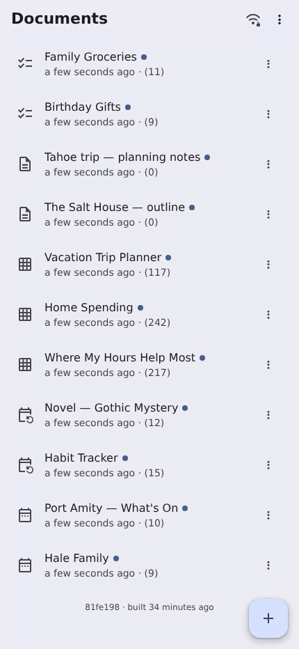
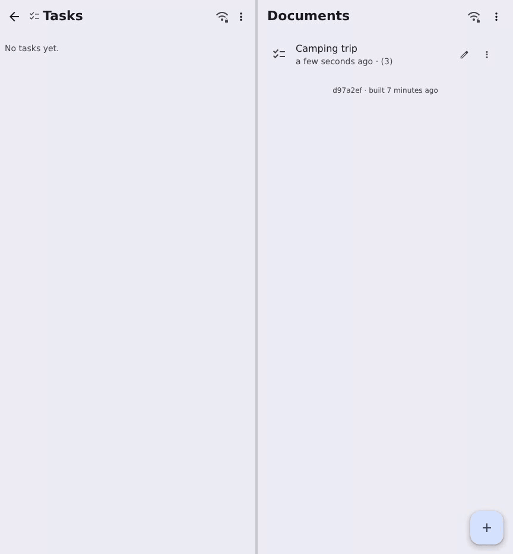

# Drive

## Signal for documents

<!-- _class: tight -->

- End-to-end encrypted by default, not as a setting
- Your documents live on your devices, not on someone's server
- Shared only with the people you choose

---

## Just a webpage

<!-- _class: tight -->

- Static files — no backend to sign up for
- Install it straight from the browser; it runs standalone on your phone
- Collaborate in real time, or edit offline and merge on reconnect

---

## Links

<!-- _class: tight -->

Try it!
- [philschatz.com/drive](https://philschatz.com/drive) (it's GitHub Pages)
- [philschatz.com/drive/slides](https://philschatz.com/drive/slides) these slides

---

## Four pieces

<!-- _class: tight -->

- **PWA** — installable, offline, precached
- **Automerge** — CRDTs, so concurrent and offline edits merge without conflicts
- **Keyhive** — identity, access control, encryption
- **Relay** — a stateless server whose only job is helping your devices and friends find each other

---

## Relay, then direct

<!-- _class: tight -->

- The relay does discovery and forwards opaque bytes by target id
- Once two peers know about each other, they upgrade to a direct WebRTC channel
- Same peer ids, same messages either way — the upgrade is invisible above the transport
- A pair that can't punch through NAT just stays on the relay

---

## End-to-end encrypted

- Keyhive wraps a **single** network adapter — everything below it is interchangeable transport
- Document changes, membership ops, and presence are all encrypted before they leave the device
- The relay sees ciphertext plus an address; it is never a member of anything
- Every share or revoke rotates the document key to a new epoch

---

## The ask

- This is a prototype exploring the design, not a product
- I'd rather help someone build theirs than duplicate the work
- If you're already building local-first, E2E-encrypted collaborative documents, I'd like to contribute
- So: tell me who to talk to

---

## Devices, users, QR

<!-- _class: tight -->

- A device is a keyhive identity — an ed25519 key
- A user is a keyhive **group of their devices**, so documents are shared with the group and every device gets access
- Adding a device *or* a friend is the same move: scan a QR code
- The QR carries a rendezvous channel id plus the key to decrypt it; the keyhive material is exchanged over that encrypted channel

---

## Thin UI, fat worker

<!-- _class: tight -->

- Presence is encrypted with the document's own key — only members can see who's editing what
- The main thread is only UI; a worker owns local and remote updates (automerge, keyhive, transports)
- The UI subscribes to small **jq query slices**, so it never holds a whole document in memory
- The relay never stores messages for later delivery, so the always-online peer keeps a handful of docs open and **cycles through the rest** looking for updates — a browser tab just holds its whole list open

---

## Presence dots

<!-- _class: tight -->

- A peer's presence is a **path into the document** (e.g. `['events', uid, 'title']`), never screen coordinates
- So any view can render it — the calendar, the grid, and the raw JSON editor all highlight the same node
- A dot marks the field a peer is editing: **filled** for direct P2P, a **hollow ring** for relay
- The field is greyed out letting a peer know it's being edited without stopping them

---

## Data design

<!-- _class: tight -->

- Every doc type has a schema covering structure *and* data dependencies — due dates, formula references, cell keys must all resolve
- Shapes are chosen *for* the CRDT: id-keyed maps instead of arrays, fractional indices for order
- The spreadsheet is the hard case, so formulas reference row/column **ids** — reordering never rewrites them
- Calendar, tasks, and counters follow open specs (JSCalendar / RFC 8984)

---

## An always-on device

- Link a device with read-only access and it just syncs, keeping a copy of everything
- Because it's always online, it's the peer two phones meet when they're never open at the same time
- That covers store-and-forward without the relay ever holding plaintext

---

## Keyhive gaps

- **Serialization** — freshly rotated keys lived only in memory, so a reload lost them ("Key not found" forever)
- **Transitive access** — groups as members of groups and documents, with access capped to the minimum along each path
- **Update events** — a callback per keyhive event, so the app can persist and refresh reactively
- Plus one upstream panic: encrypting presence right after a remote rekey

---

## Future: mobile app

- Better notifications — a PWA can't reliably wake up to say "someone edited this"
- Background sync, so a phone stays current without the app open
- Access to phone features: contacts, calendar, camera, files
- The worker and crypto core stay as-is — only the shell changes
