# Drive

- Signal for Docs
- Tech, Features, Challenges, Designs

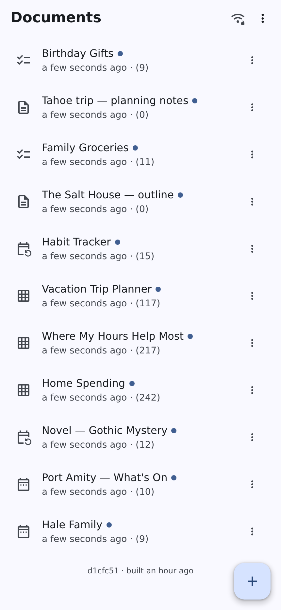

---

# Tech

- [PWA](https://web.dev/learn/pwa/progressive-web-apps/)
- [Automerge](https://automerge.org/) (& [Peritext](https://www.inkandswitch.com/peritext/))
- [Keyhive](https://www.inkandswitch.com/project/keyhive/)
- relay

Links

- [philschatz.com/drive](https://philschatz.com/drive/)
- [philschatz.com/drive/slides](https://philschatz.com/drive/slides/)

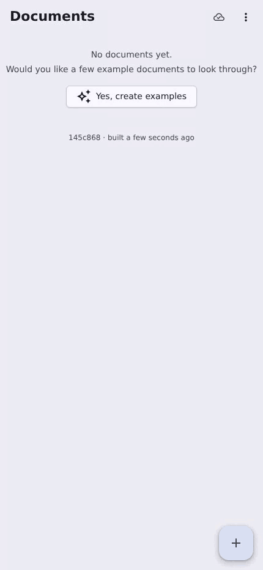

<!--
- Automerge is the CRDT; Peritext is the rich-text half of it, which is what makes a caret survive someone else's edit
- Keyhive is the encryption and access layer: devices, groups, documents, roles
- The relay is stateless and never holds plaintext — it introduces peers and forwards opaque bytes
-->

---

# Features

- Direct P2P or Offline
- Multiple Devices
- QR Codes for invites
- Document Validation

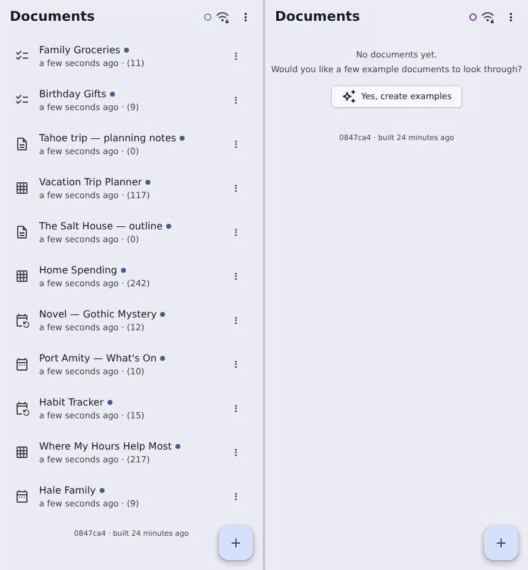

<!--
- Peers upgrade to a direct WebRTC channel when they can, and fall back to the relay when they cannot
- A user is a group of their devices, so sharing with a person shares with every device they own
- Five document types, each with a schema — calendar, tasks, counters, spreadsheet, prose
-->

---

# Challenges

- docs are big
- adding devices
    - sharing more than a few bytes: Rendezvous
- keyhive problems
    - serialize methods
    - transitive roles
- schema designed for concurrency

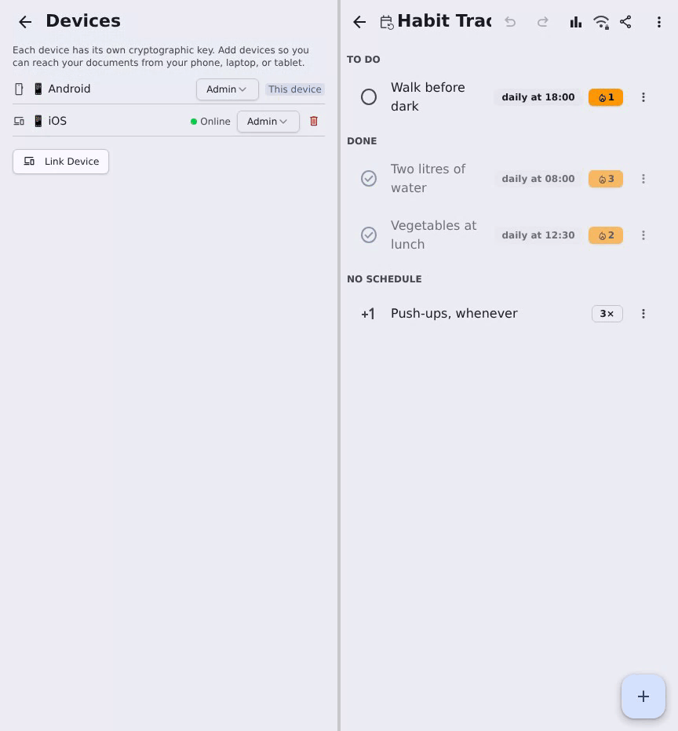

<!--
- A QR code holds a few hundred bytes; the keyhive material to link a device is tens of kilobytes, hence the rendezvous channel
- Keyhive gaps that had to be filled: freshly rotated keys lived only in memory so a reload lost them; groups as members of groups, with access capped to the minimum along each path; an event per change so the app can persist and refresh
- Roles are live delegations, so revoking one changes what the *other* device can do without asking it anything
-->

---

# Design

- Invitations
- Relay
- UI/Worker
- Doc format

---

# Design:Relay

- 2 channels
    - peer-matched (keyhive)
    - rendezvous (invites)
- evolved:
    1. public
    1. all-to-all (let peers decide)
    1. match groupid & watch list
    1. future: HMAC rotation

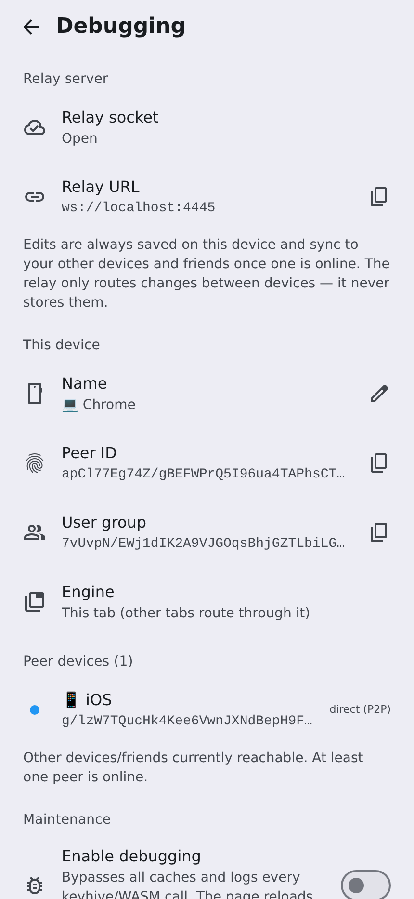

---

# Adding a Device

- A **user** is a group of devices, each its own keyhive key
- The QR carries a rendezvous id and the key to decrypt it

---

# Adding a Device

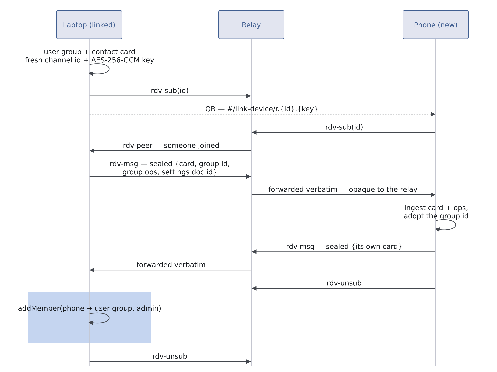

<!--
- Each device declares its own user group plus the groups it knows (friends, doc co-members); the relay only introduces same-group devices and mutual watchers
- Un-friending withdraws the match and the relay dissolves the pair — strangers sharing a relay never learn of each other
- Group ids are self-asserted routing hints today; the HMAC daily token is designed and deferred
-->

---

# Design:Browser

- open all docs? No
- main
    - UI
    - partial doc (jq subscription)
    - serialize mutations
- worker
    - all state
    - network, opens docs, sends qupdate

<!--
- The main thread is only UI; a worker owns local and remote updates (automerge, keyhive, transports)
- The UI subscribes to small jq query slices, so it never holds a whole document in memory
- Presence is a path into the document (e.g. ['events', uid, 'title']), never screen coordinates — so any view can render it, and it is encrypted with the document's own key
- The relay never stores messages for later delivery, so the always-online peer cycles through documents looking for updates
-->

---

# Design:Documents

- validate every change
- schema checks interdeps
- sheet challenges
    - from `=SUM(Sheet2!A1:$A$10)`
    - to `=SUM({R[xxx]C[yyy]S{zzz}}:{R{www}C{yyy}S{zzz}})`

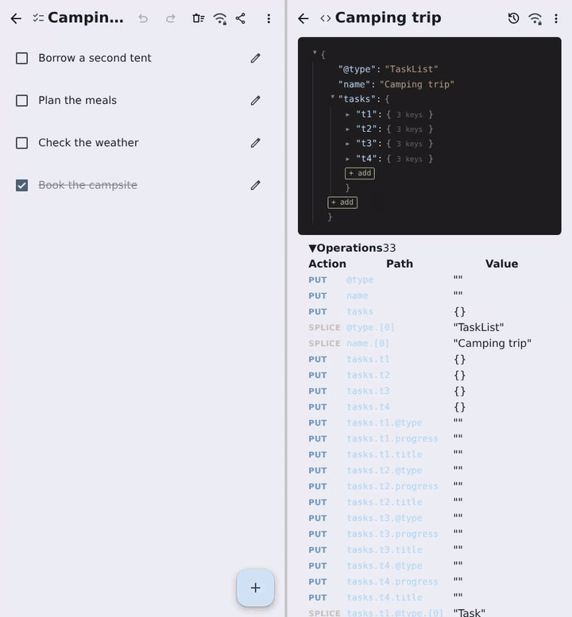

<!--
- Every doc type has a schema covering structure *and* data dependencies — due dates, formula references, cell keys must all resolve
- Shapes are chosen *for* the CRDT: id-keyed maps instead of arrays, fractional indices for order
- Formulas reference row/column ids, so reordering never rewrites them — that is what the second form buys
- Validation runs on local and remote changes alike, and errors are advisory rather than a block
-->

---

# Screen caps

The rest of slides are screencaps

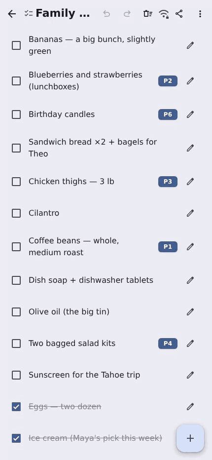

---

## Adding a device

<!-- _class: tight diagram -->

- 2 channels
    - peer-matched (keyhive)
    - rendezvous (invites)
- evolved:
    1. public
    1. all-to-all (let peers decide)
    1. match groupid & watch list
    1. future: HMAC rotation

<!--
- The relay routes rendezvous by channel id and never sees plaintext; this is the one path a device with no group yet can use, since it has nothing to be introduced by
- Both directions are sealed under the same key — the bundle crossing back is the phone's own card
- The highlighted row is the moment the new device has access to anything
- Then it is just a peer: the phone re-announces its group, the relay's same-group rule pairs the sockets, and the document list is whatever keyhive says it can reach
-->

---

## Adding a friend

<!-- _class: tight diagram -->

- Same QR, other direction: the invite carries a **document**
- Sharing names a role; the member list *is* the access

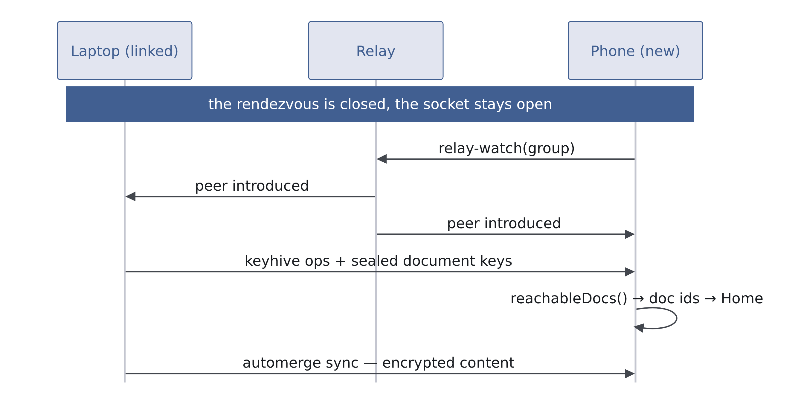

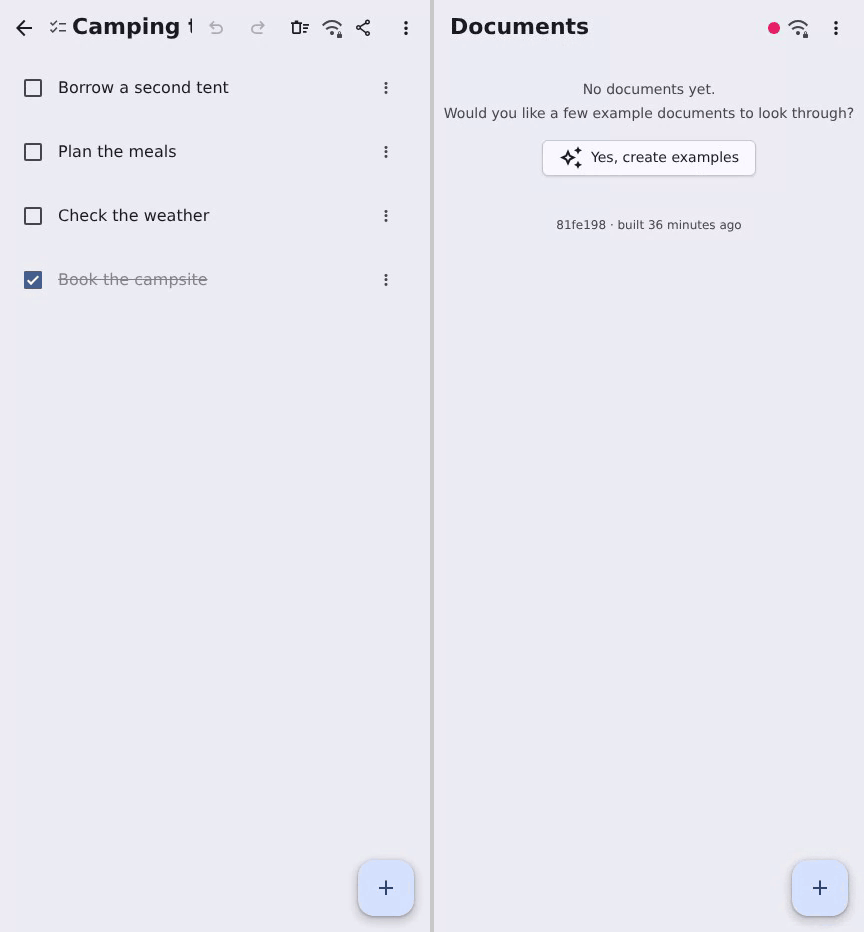

<!--
- Once the exchange is done both sides are ordinary peers, which is what this diagram is: announce, get paired, sync keyhive, and the reachable documents follow
- Document ids were never in the QR payload — the new peer asks keyhive what it can reach
- Content only flows because keyhive says it may; the relay is forwarding ciphertext it cannot read either way
-->

---

## Presence updates (spreadsheet)

<!-- _class: tight -->

- Both peers pan and select freely; each sees the other's cell outlined and tagged, in that peer's own colour
- Retype one input and every figure derived from it moves on both screens

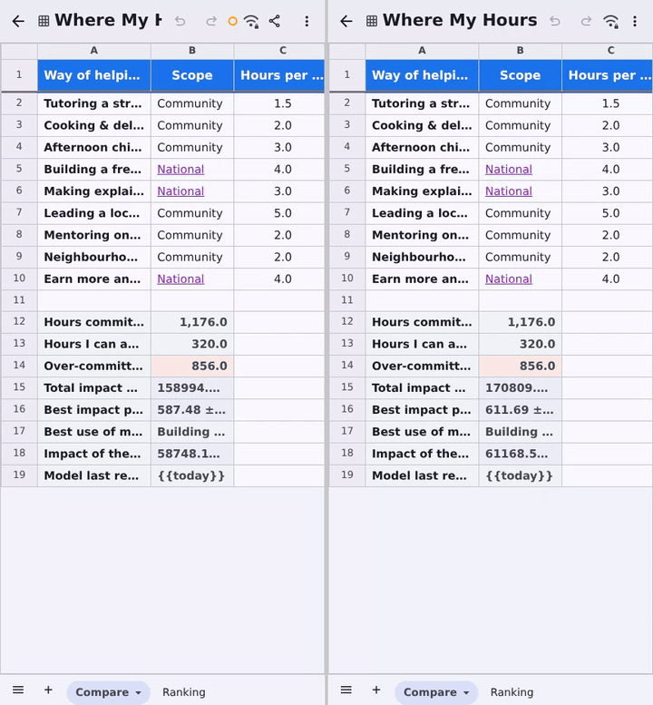

---

## Presence updates (peritext doc)

<!-- _class: tight -->

- A caret is an **Automerge cursor**, not an offset — it names a character, so it survives someone else's edit
- Both peers select; each sees the other's selection tagged with their name
- Phil edits *ahead* of Sam and Sam's selection stays on the same words — then Sam types and replaces exactly those
- Positions resolve in the **same worker push** as the text they describe, so a caret is never a frame stale

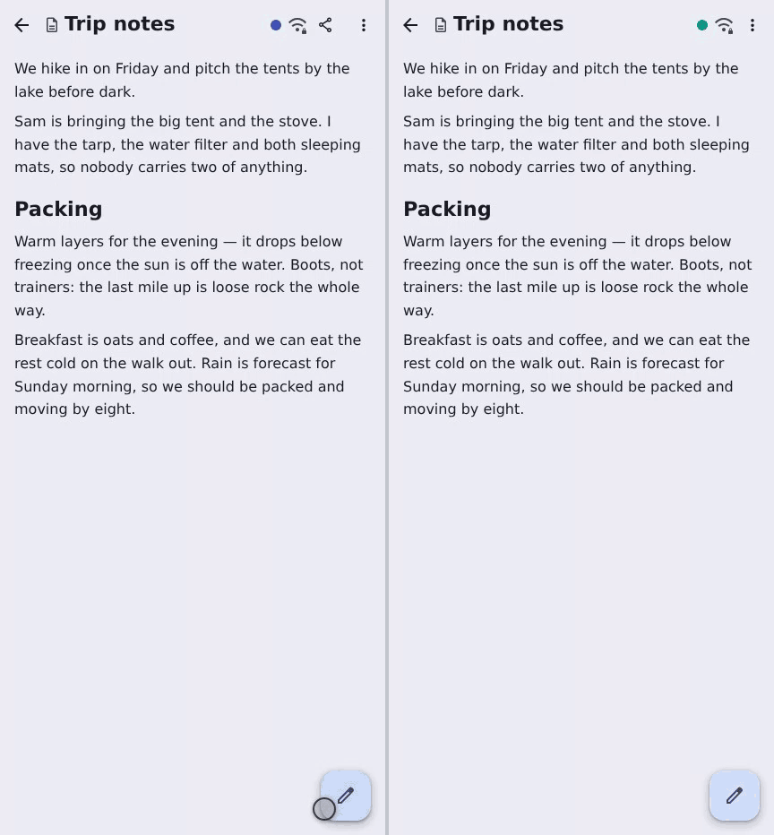

---

## Source editing

<!-- _class: tight -->

- Underneath it is all JSON, so the raw editor is one more view over the same tree
- The dot tracks the peer's selected cell, because presence is a path rather than a coordinate
- Cells are sparse, so typing into an empty one *creates* the key — it appears in the other pane mid-list

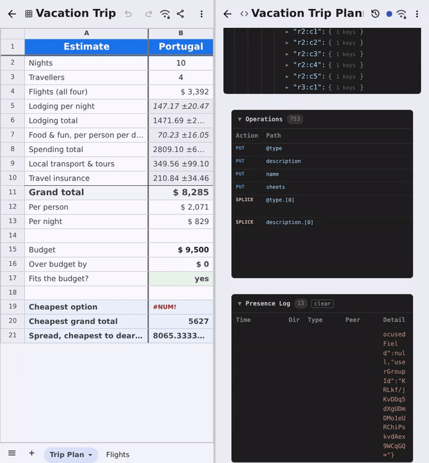
