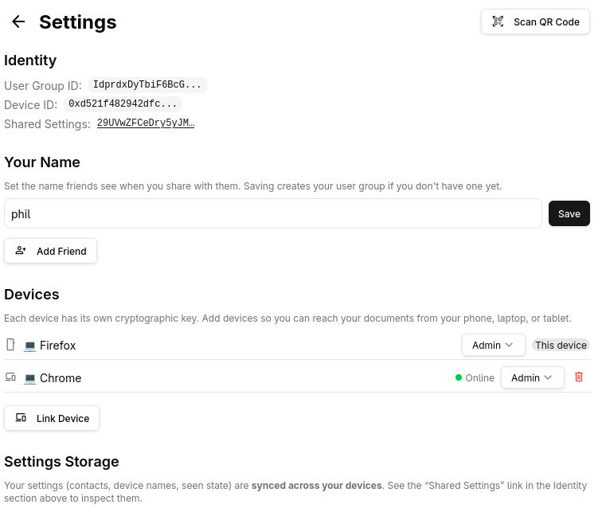
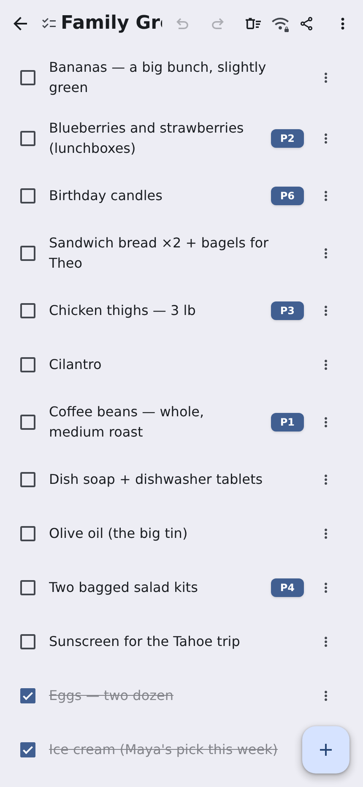

# Drive

## What is it?

<!-- _class: tight -->

- Signal for documents
- E2E encryption
- Docs live on your devices

---

## Yeah but what's it made of?

<!-- _class: tight -->

- PWA
- Automerge
- Keyhive
- relay server

<!--
- Just static files (GH Pages)
- Runs offline on your phone (PWA)
- Peers find each other through a relay
-->

---

## Links

<!-- _class: tight -->

Try it!
- [philschatz.com/drive](https://philschatz.com/drive) (it's GitHub Pages)
- [philschatz.com/drive/slides](https://philschatz.com/drive/slides) these slides

---

## Relay 2 WebRTC

<!-- _class: tight -->

- introduces peers
- use group id to match
- peers upgrade to WebRTC

<!--
- The relay does discovery and forwards opaque bytes by target id
- Once two peers know about each other, they upgrade to a direct WebRTC channel
- Same peer ids, same messages either way — the upgrade is invisible above the transport
- A pair that can't punch through NAT just stays on the relay
-->

---

## E2EZ

<!-- _class: tight -->

- Keyhive wraps a **single** network adapter — everything below it is interchangeable transport
- Document changes, membership ops, and presence are all encrypted before they leave the device
- The relay sees ciphertext plus an address; it is never a member of anything
- Every share or revoke rotates the document key to a new epoch — so a role change lands on the other screen as it happens

---

## The ask

- I'd rather help someone build theirs than duplicate the work
- If you're already building local-first, E2E-encrypted collaborative documents, I'd like to contribute
- So: tell me who to talk to

---

## Devices, users, QR

<!-- _class: tight -->

- A device is a keyhive identity — an ed25519 key
- A user is a keyhive **group of their devices**, so documents are shared with the group and every device gets access
- Adding a device *or* a friend is the same move: scan a QR code
- The QR carries a rendezvous channel id plus the key to decrypt it; the keyhive material is exchanged over that encrypted channel

---

## Sharing with a friend

<!-- _class: tight -->

- Same QR, other direction: the invite carries the document instead of a device
- Sharing always names a role, so there is no "shared, figure the rest out later"
- The member list *is* the access — every row is a live keyhive delegation, not a record of one

---

## Thin UI, fat worker

<!-- _class: tight -->

- Presence is encrypted with the document's own key — only members can see who's editing what
- The main thread is only UI; a worker owns local and remote updates (automerge, keyhive, transports)
- The UI subscribes to small **jq query slices**, so it never holds a whole document in memory
- The relay never stores messages for later delivery, so the always-online peer keeps a handful of docs open and **cycles through the rest** looking for updates — a browser tab just holds its whole list open
- Underneath it is all JSON, so the raw editor is one more view over the same tree

---

## Presence dots

<!-- _class: tight -->

- A peer's presence is a **path into the document** (e.g. `['events', uid, 'title']`), never screen coordinates
- So any view can render it — the calendar, the grid, and the raw JSON editor all highlight the same node
- A dot marks the field a peer is editing: **filled** for direct P2P, a **hollow ring** for relay
- The field is greyed out letting a peer know it's being edited without stopping them

---

## Presence in a spreadsheet

<!-- _class: tight -->

- Both peers pan and select freely; each sees the other's cell outlined and tagged, in that peer's own colour
- Retype one input and every figure derived from it moves on both screens

---

## Data design

<!-- _class: tight -->

- Every doc type has a schema covering structure *and* data dependencies — due dates, formula references, cell keys must all resolve
- Shapes are chosen *for* the CRDT: id-keyed maps instead of arrays, fractional indices for order
- The spreadsheet is the hard case, so formulas reference row/column **ids** — reordering never rewrites them
- Calendar, tasks, and counters follow open specs (JSCalendar / RFC 8984)
- Every change is re-validated, locally and from peers — errors are advisory, never a block

---

## An always-on device

- Link a device with read-only access and it just syncs, keeping a copy of everything
- Because it's always online, it's the peer two phones meet when they're never open at the same time
- That covers store-and-forward without the relay ever holding plaintext

---

## Keyhive gaps

<!-- _class: tight -->

- **Serialization** — freshly rotated keys lived only in memory, so a reload lost them ("Key not found" forever)
- **Transitive access** — groups as members of groups and documents, with access capped to the minimum along each path
- **Update events** — a callback per keyhive event, so the app can persist and refresh reactively
- Plus one upstream panic: encrypting presence right after a remote rekey
- Went through many iterations. Initially it was just devices, not user groups, and then the relay just broadcast all peers to each other and let them sort it out.

---

## Future: A real mobile app?

- Better notifications — a PWA can't reliably wake up to say "someone edited this"
- Background sync, so a phone stays current without the app open
- Access to phone features: contacts, calendar, camera, files

